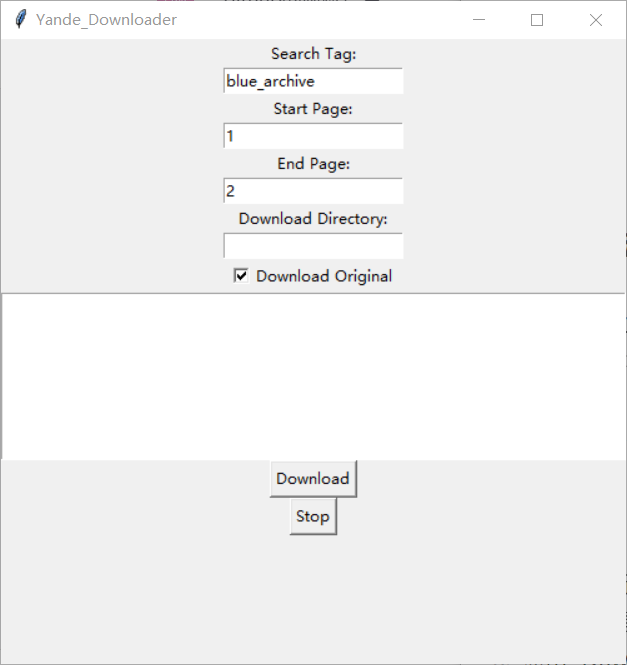

# Yande Downloader

[](https://github.com/VCE1/yande_downloader/blob/main/LICENSE)

Yande Downloader 是一个用于从 [yande.re](https://yande.re/) 下载图片的工具。它允许您指定页面范围进行爬取，每个页面包含40张图片。您可以选择下载原图或非原图（压缩后的JPG格式）。该工具还支持按标签搜索。下载的图片将按照当天的日期和指定的标签创建目录并存储，您也可以指定下载目录。

## 功能特点

-   每个页面包含40张图片。
-   基于指定页面范围爬取图片。
-   支持下载原图或非原图（压缩后的JPG）图片。
-   支持按标签搜索。
-   图片存储在以当天日期和指定标签命名的目录中。
-   可以指定下载目录。
-   使用多线程和异步提高下载速度。

## 安装

克隆项目仓库：
```shell
git clone 
https://github.com/VCE1/yande_downloader.git
```
进入项目目录：
```shell
cd 
yande_downloader
```
安装依赖：

```python
pip install -r requirements.txt
```

### 使用方法

运行 [main.py](https://github.com/VCE1/yande_downloader/blob/master/main.py)文件：
```python
python main.py
```


1.  填写搜索标签、开始页码、结束页码和下载目录。
2.  可以选择是否下载原图。
3.  点击 "Download" 按钮开始下载。
4.  可以点击 "Stop" 按钮停止下载。




本项目基于 [MIT 许可证](LICENSE)。详细信息请参阅 LICENSE 文件。

## 致谢
本项目灵感和部分代码参考了 [Yandere-crawler](https://github.com/mokeyjay/Yandere-crawler) 项目。